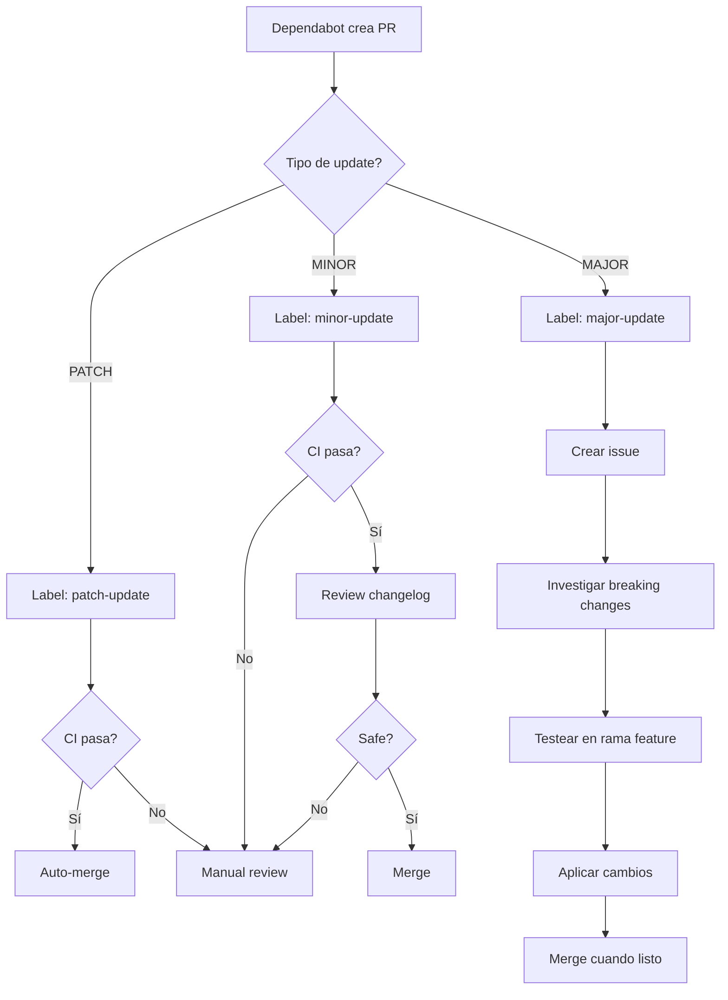

# Estrategia de Dependabot - SaintGrove Project

## Objetivo

Mantener las dependencias actualizadas de forma **segura, automatizada y escalable**, minimizando riesgo de breaking changes mientras se aplican parches de seguridad rápidamente.

---

## Configuración Actual

- **Frecuencia**: Semanal (Lunes 9:00 AM México)
- **Ecosistemas**: npm (frontend) + GitHub Actions
- **Pull Requests**: Máximo 10 PRs abiertos simultáneamente
- **Agrupación**: Por categorías (React, Testing, TypeScript, UI, etc.)

---

## Estrategia por Tipo de Actualización

### 🟢 PATCH Updates (1.0.0 → 1.0.1)

**Qué son**: Bugfixes y security patches. Sin breaking changes.

**Proceso:**
1. ✅ Dependabot crea PR automáticamente
2. ✅ CI ejecuta todos los tests
3. ✅ **Si CI pasa → Merge automático** (recomendado)
4. ✅ Si CI falla → Revisión manual

**Labels**: `dependencies`, `patch-update`, `auto-merge`

**Target Branch**: `main`

**Frecuencia**: Semanal (+ security alerts diarias)

**Acción Recomendada**: **AUTO-MERGE habilitado**

**Excepciones** (NO auto-merge):
- React, React-DOM, Next.js (frameworks críticos)
- Dependencias con historial de issues

---

### 🟡 MINOR Updates (1.0.0 → 1.1.0)

**Qué son**: Nuevas funcionalidades backwards-compatible.

**Proceso:**
1. ✅ Dependabot crea PR automáticamente
2. ✅ CI ejecuta todos los tests
3. ⚠️ **Revisión rápida del changelog** (5-10 min)
4. ✅ Si CI pasa + sin breaking changes → Merge
5. ❌ Si hay dudas → Esperar a revisión completa

**Labels**: `dependencies`, `minor-update`

**Target Branch**: `main`

**Frecuencia**: Semanal

**Acción Recomendada**: **Merge manual después de revisar changelog**

**Checklist antes de merge:**
- [ ] CI pasó ✅
- [ ] Changelog revisado (sin breaking changes mencionados)
- [ ] No hay warnings nuevos en el build
- [ ] Coverage no bajó significativamente

---

### 🔴 MAJOR Updates (1.0.0 → 2.0.0)

**Qué son**: Breaking changes. Requiere cambios en el código.

**Proceso:**
1. ✅ Dependabot crea PR automáticamente
2. ⚠️ **NO mergear directamente**
3. 📋 Crear issue vinculado: "Upgrade [package] v1 → v2"
4. 📚 Investigar:
   - Migration guide oficial
   - Breaking changes listados
   - Impacto en el codebase
5. 🧪 Testear localmente en rama separada
6. 📝 Documentar cambios necesarios
7. ✅ Aplicar cambios + tests
8. ✅ Merge solo cuando esté 100% validado

**Labels**: `dependencies`, `major-update`, `breaking-change`, `needs-review`

**Target Branch**: `develop` (si existe) o crear rama `feature/upgrade-[package]-v2`

**Frecuencia**: Mensual (evitar acumulación)

**Acción Recomendada**: **Revisión manual exhaustiva + testing dedicado**

**Ejemplos recientes en tu proyecto:**
- `tailwindcss: 3.4.18 → 4.1.17` 🔴 (Requiere migración de config)
- `@react-email/components: 0.5.7 → 1.0.0` 🔴 (Validar templates)

---

## Dependencias Críticas (Protegidas)

Estas dependencias **NUNCA** se actualizan automáticamente en MAJOR:

| Dependencia | Razón | Estrategia |
|-------------|-------|------------|
| `react` | Framework core | Manual review + testing completo |
| `react-dom` | Framework core | Manual review + testing completo |
| `next` | Framework principal | Manual review + testear todas las rutas |
| `typescript` | Afecta todo el codebase | Revisar changelog + fix type errors |

**Configuración actual:**
```yaml
ignore:
  - dependency-name: "react"
    update-types: ["version-update:semver-major"]
  - dependency-name: "react-dom"
    update-types: ["version-update:semver-major"]
  - dependency-name: "next"
    update-types: ["version-update:semver-major"]
```

---

## Configuración de Frecuencias

### Opción 1: Balance Seguridad/Mantenimiento (ACTUAL)
```yaml
schedule:
  interval: "weekly"    # Lunes 9:00 AM
  day: "monday"
```
- ✅ Actualizado regularmente
- ✅ Security patches aplicados en ~7 días
- ⚠️ Puede generar 5-10 PRs por semana

### Opción 2: Solo Security Updates (Conservador)
```yaml
schedule:
  interval: "monthly"   # Primer lunes del mes
  day: "monday"
```
- ⚠️ Updates menos frecuentes
- ✅ Menos PRs que revisar
- ❌ Security patches tardan hasta 30 días
- **NOTA**: Security alerts siempre son diarias (no configurable)

### Opción 3: Aggressive (Solo para equipos grandes)
```yaml
schedule:
  interval: "daily"
```
- ❌ **NO RECOMENDADO** para equipos pequeños
- Demasiados PRs diarios

**RECOMENDACIÓN PARA SAINTGROVE**:
- **Weekly** para npm packages
- **Weekly** para GitHub Actions
- Security alerts quedan en **daily** (automático)

---

## Workflow de Aprobación

### Flujo Automatizado con Labels



---

## Comandos Útiles

### Revisar un PR de Dependabot localmente

```bash
# Fetch el PR (ejemplo: PR #10)
gh pr checkout 10

# Instalar dependencias actualizadas
cd frontend && npm install

# Correr tests
npm run test
npm run test:e2e

# Correr build
npm run build

# Si todo pasa, hacer merge desde GitHub UI
```

### Cerrar un PR de Dependabot (rechazar update)

```bash
# Comentar en el PR:
@dependabot ignore this major version

# O cerrar manualmente:
gh pr close 10
```

### Reabrir un PR de Dependabot

```bash
@dependabot reopen
```

### Mergear múltiples PRs de golpe

```bash
# Solo si todos pasaron CI
gh pr merge 10 --squash --auto
gh pr merge 11 --squash --auto
gh pr merge 12 --squash --auto
```

---

## Mejores Prácticas

### ✅ DO (Hacer)

1. **Revisar PRs de Dependabot semanalmente** (no dejar acumular)
2. **Leer el changelog** antes de mergear MINOR/MAJOR
3. **Testear localmente** las actualizaciones MAJOR
4. **Mergear PATCH updates rápidamente** (especialmente security)
5. **Agrupar updates relacionados** (ya configurado)
6. **Mantener coverage de tests alto** (para detectar breaking changes)

### ❌ DON'T (No hacer)

1. **NO ignorar security updates** sin razón válida
2. **NO mergear MAJOR updates sin testing**
3. **NO cerrar PRs automáticamente** sin revisar
4. **NO deshabilitar Dependabot** (actualizar config en su lugar)
5. **NO mergear si CI falla** (investigar primero)
6. **NO actualizar React/Next en producción** sin staging test

---

## Casos Especiales

### Security Vulnerabilities (Critical)

Dependabot crea PR inmediatamente, fuera del schedule semanal.

**Acción:**
1. ⚠️ **Prioridad MÁXIMA**
2. Revisar severity (critical > high > moderate > low)
3. Si es PATCH/MINOR → Merge inmediatamente si CI pasa
4. Si es MAJOR → Evaluar workaround temporal vs. upgrade completo

### Conflictos entre PRs

Si hay múltiples PRs con conflictos:
1. Mergear de menor a mayor impacto (PATCH → MINOR → MAJOR)
2. Rebase automático hará que Dependabot actualice los demás PRs
3. Esperar ~5 min entre merges para que Dependabot rebase

### Updates que Rompen CI

1. Ver logs del CI en el PR
2. Si es timeout/flaky test → Re-run CI
3. Si es breaking change real → Ver "MAJOR Updates" strategy
4. Comentar en el PR el problema encontrado

---

## Monitoreo y Métricas

### KPIs Recomendados

- **Dependency Freshness**: % de dependencias en última versión
- **Security Debt**: # de vulnerabilidades abiertas
- **PR Age**: Tiempo promedio para mergear un PR de Dependabot
- **CI Success Rate**: % de PRs de Dependabot que pasan CI

### Herramientas

- GitHub Insights → Dependency Graph
- GitHub Security → Dependabot Alerts
- SonarCloud → Code Quality impact

---

## Configuración Avanzada (Futuro)

### Auto-merge para PATCH (Opción)

Si quieres habilitar auto-merge para patches seguros:

1. Habilitar en repo settings:
   - Settings → General → Allow auto-merge
   - Settings → Branches → Require status checks to pass

2. Añadir a `.github/dependabot.yml`:
```yaml
# En la sección de npm:
open-pull-requests-limit: 15  # Aumentar límite

# Labels personalizados
labels:
  - "dependencies"
  - "automerge"  # Nuevo label
```

3. Crear GitHub Action para auto-merge:
   - `.github/workflows/auto-merge-dependabot.yml`

### Scheduled Updates por Tipo

```yaml
# OPCIÓN FUTURA: Multiple update configs
updates:
  # Security patches: Daily
  - package-ecosystem: "npm"
    directory: "/frontend"
    schedule:
      interval: "daily"
    open-pull-requests-limit: 3
    target-branch: "main"
    labels: ["security-patch"]

  # Regular updates: Monthly
  - package-ecosystem: "npm"
    directory: "/frontend"
    schedule:
      interval: "monthly"
    target-branch: "develop"
```

**NOTA**: GitHub no soporta múltiples configs para el mismo directorio todavía.

---

## Contacto y Responsables

- **Maintainer**: SaintGrove Team
- **Reviewer Primario**: @rojoprogramador
- **Escalation**: Crear issue en repo

---

## Changelog de Esta Estrategia

| Fecha | Versión | Cambios |
|-------|---------|---------|
| 2025-01-18 | 1.0 | Estrategia inicial documentada |

---

## Referencias

- [Dependabot Configuration Docs](https://docs.github.com/en/code-security/dependabot/dependabot-version-updates/configuration-options-for-the-dependabot.yml-file)
- [Semantic Versioning](https://semver.org/)
- [Keep a Changelog](https://keepachangelog.com/)
